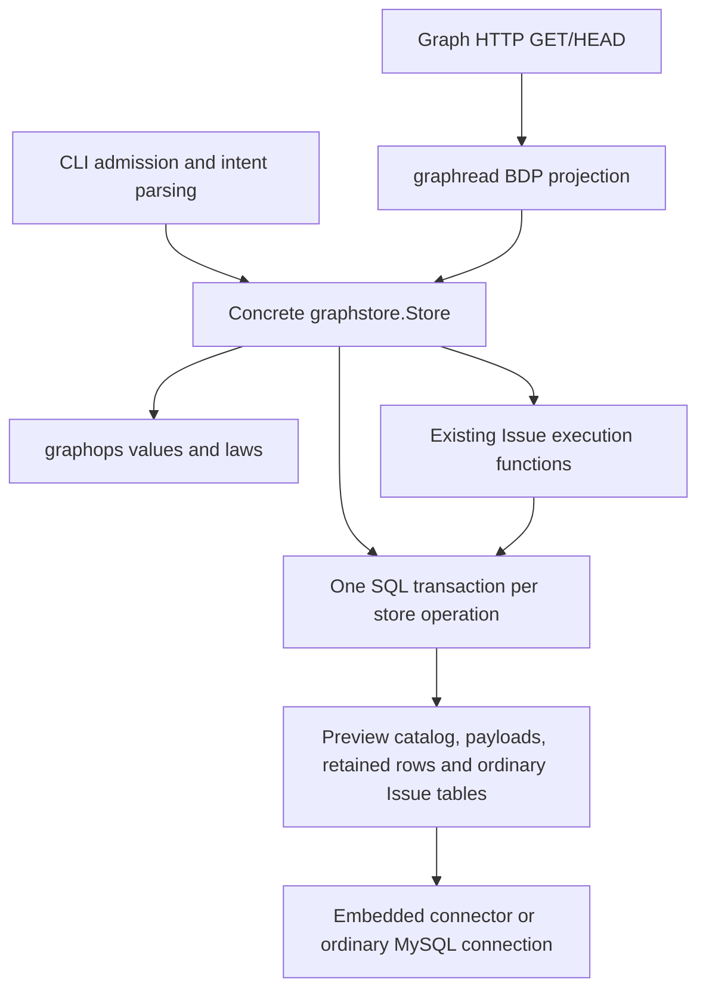

# Beads/BDP V2 — current runtime boundary map

Owner: Vickie. Plan of record: [gastownhall/beads#7403](https://github.com/gastownhall/beads/issues/7403), S1. October 8, 2026.

This is source analysis for a separate V2 design stream, not a normative specification, runtime qualification or release recommendation. Donna rules on product choices; Trish owns Type lifecycle (#59/PR60); Janet owns Preview 2 integration, current CLI/BDP alignment and qualification (#7170). No source, test, playground or database was changed or executed.

## Baselines and method

| Evidence | Repository/ref | Exact commit | Use |
| --- | --- | --- | --- |
| Runtime | donnabox/beads, release/preview2-integration | `23c54902ca14087c5766eec6be2784ed71d7a216` | Primary current-runtime snapshot; not upstream main and not proof of a released binary. |
| Normative BDP | gastownhall/bdp, main | `182f1fcf8a01d896976bff3c9e3fb87c596c6ca6` | Current protocol/Type/profile boundaries. |
| Type proposal | gastownhall/bdp, PR60 | `40061cf111da52cb5a364ba7639b99435175a5f2` | October 8 brittleness map and recorded design direction; not an adopted specification. |
| CLI draft metadata | versioned-beads/beads, PR102; head repository donnabox/beads | `94d880d4b7bdb87468281c1a7453b94387aacb2e` | Remote head/state verified only. This report does not claim to have audited the whole CLI draft. |

Refs were resolved remotely before reading. Runtime source was extracted from the exact-commit archive into an isolated source snapshot. Cited runtime files were checked against Git blob IDs from that commit's complete remote tree. Citations below resolve to those immutable revisions. Source observations describe control flow and declared contracts; concurrency correctness, performance and engine failure behavior were not independently tested. Prior release test receipts are not adopted as this map's evidence.

## Main finding

The preview's active graph boundary is the concrete `graphstore.Store`. It combines workspace binding, fixed Type catalog checks, graph allocation/revision bookkeeping, operation-specific validation and SQL transactions. CLI handlers and the BDP Read adapter call that concrete store. The exported `graphops` package supplies values, laws and role declarations, but does not itself implement a graph application service. [Graph foundation][foundation], [store ownership][backend], [HTTP projection][reader].

There is an existing reusable Issue-domain seam: graph Issue updates call the ordinary Issue execution functions inside the graph-owned SQL transaction. The V2 decision is therefore about where graph-wide guarantees belong and how domain operations participate; the current code does not require choosing between retaining all preview glue and rewriting Issue semantics. This is an architectural inference, not an approved option. [Issue update][issue-update], [Issue execution][issue-execute].

This diagram shows logical calls and transaction participation, not independently deployed services. The ordinary Issue HTTP surface remains a separate configuration path.

## Boundary inventory

All rows are source-observed at the runtime baseline unless labeled otherwise.

| Boundary and owning layer | Callers → callees / responsibility | Limit or unresolved V2 consequence |
| --- | --- | --- |
| CLI workspace admission — `cmd/bd` | Root pre-run → `admitGraphPreview`; marker/config checks select graph mode before legacy discovery or maintenance. Command handlers use graph-specific dispatch. [Admission][root], [format gate][admit]. | Existing format/backend/command admission is product behavior. A V2 migration cannot simply route old stores through a new implementation without an explicit compatibility fence. |
| CLI intent and results — graph handlers | Parse flags, paths, omission/empty values and actor; invoke typed store requests; translate errors and render output. `withGraphStoreOutput` opens with a 30-second context and checks store cleanup before output. [Operation wrapper][wrapper], [Memory creation][remember]. | CLI currently owns more than presentation. Any common runtime API must decide which admission/intent rules move and which remain surface-specific. |
| Pure graph values — exported `graphops` | Storage and adapters consume canonical path/JSON/Type laws and shared refusal values. No I/O occurs in the package. [Foundation][foundation]. | `Reader`, `TypeInstaller` and identity role declarations are not evidence of served capabilities. They must not be mistaken for the current runtime composition root. |
| Workspace binding and catalog — `graphstore` | `OpenExisting`/operation transactions → `checkBinding`, checking workspace, Scope, authority identifier, schema and installed descriptors. [Open/transactions][backend], [binding][binding]. | This is preview binding validation; no general authority lease, recovery or cross-process security guarantee is inferred. |
| Type resolution — `graphstore` | CLI `types`/HTTP projection → `ListInstalledTypes`/`ReadType`; fixed admitted IDs resolve persisted canonical descriptor bytes/fingerprints. [Type reads][types]. | No arbitrary installer, version selector or remote lookup is served here. Four-Type stores stay four-Type stores; fresh installation includes six known definitions. [Installed set][type-set]. |
| Graph operations and validation — `graphstore` | Memory/Link/Issue methods validate request shape, resolve live records, enforce revisions, coordinate writes and retain accepted state. [Memory update][memory-update], [Link operations][links], [Issue update][issue-update]. | Validation is operation-specific; the inspected path is not a general runtime for arbitrary schemas/Type adoption. |
| Issue-domain execution — internal `issueops` | `UpdateIssue` converts admitted fields to `IssuePatch`, validates, reads/guards the predecessor and calls `ExecuteUpdate` under the same `*sql.Tx`, with versioned history enabled. [Issue update][issue-update], [executor][issue-execute]. | Preserve native Issue rules and retention while defining any V2 participation interface. An independently committing Issue provider would break this transaction relationship. |
| Identity, storage and backing dispatch — `graphstore` | Catalog rows select Memory, Issue, Dependency or informational backing. Current `Read` dispatches within one snapshot. Preview tables share the ordinary Beads DB; Issue/Dependency payloads are not duplicated into generic payload storage. [Schema][schema], [Read dispatch][read]. | Global Type identity and legacy absent-pin handling remain design questions; local catalog `type_url` is not the proposed exact-definition pin model. |
| Transaction and concurrency — `graphstore` over SQL | `withTx` checks branch/settings, runs one callback, rolls back reads and commits writes without replay. Controlled writes update one store-wide writer token alongside payload/history changes. [Transactions][tx], [coordination cell][coordination]. | SQL transaction machinery already exists, but arbitrary multi-resource repair is not an exposed operation. Contention and scaling of the store-wide cell remain unmeasured. |
| Engine lifetime — `graphstore`/embedded connector | Embedded uses `embeddeddolt.OpenSQL`; server mode uses an ordinary MySQL client. Store pools are capped at one connection. Embedded cleanup closes DB and connector; server cleanup closes the client pool. [Backend][backend], [embedded open][embedded]. | Closing a server socket does not prove server-side termination. Connector acquisition backoff is distinct from replaying a graph mutation. Engine implementation and broad recovery semantics were not audited. |
| Revisions and retained state — graph store plus native Issue recorder | Memory/Link snapshots use preview retained rows; Issue versions map graph tokens to native Issue history with owned state. `ReadVersion` and bounded `Versions` read retained records. [Schema][schema], [exact read][history], [listing][versions]. | Current CLI retention is not full public BDP History, scope-order or event/change-context support. A Type-only adoption must not disappear as a property no-op. |
| HTTP transport — `httpapi`/`graphread` | `runGraphServe` opens an existing ordinary server store, constructs the reader and passes GraphRead to the HTTP server. GET/HEAD routes project public BDP records. [Serve][serve], [projection][reader], [routes][http]. | Embedded graph serving, graph HTTP mutation, History and aliases are excluded. GraphRead configuration explicitly refuses legacy provider/role/event sources. [Source exclusion][http-config]. |
| Error projection — CLI and HTTP adapters | CLI maps store refusals to named codes/exits; BDP Read maps errors to public read problems, including masking gone as resource-not-found. [CLI errors][cli-errors], [HTTP errors][http-errors]. | V2 should define a common operation outcome model without erasing transport-specific disclosure or retry policy. Unknown commit outcome is not a known rollback. |

## Representative end-to-end paths

### 1. CLI Memory create

Root admission selects a supported graph workspace. `runGraphPreviewRemember` checks write policy and flag combinations, allocates/validates an ID and constructs title/body input. `withGraphStore` opens the selected store. `Store.Create` makes the revision and canonical snapshot; inside `withTx` it checks binding, changes the coordination cell, reserves the catalog identity, writes payload and inserts the retained snapshot. Only after commit and checked store cleanup does the CLI emit success. [Root][root], [remember][remember], [create][create], [wrapper][wrapper].

**Boundary:** identity reservation, payload and retained snapshot are one store transaction. Input convenience and output policy remain in CLI. Commit error classification can return unknown outcome without a success record; that does not mean nothing committed.

### 2. Current read through CLI or HTTP

`show` resolves the local selector and calls `Store.Read` (or `ReadVersion` for an explicit version). `Read` checks acquisition bounds and binding and selects the backing in one read transaction, including owned state. The CLI renders after cleanup. HTTP `GraphRead` compiles a permitted route, calls `graphread.Reader.Resource`, then projects the record into `bdpwire`. For Beads, projection separately calls `ReadType`. [CLI read][show], [store read][read], [projection][reader], [HTTP routes][routes].

**Boundary:** the separate descriptor read is justified in source by the fixed immutable installed catalog and repeated checks. V2 must supply an equally explicit guarantee when definitions are versioned or removable. A resource's exact definition must not become an implicit floating lookup during projection. The mechanism is still to be designed.

### 3. Graph Issue update preserving ordinary semantics

The graph CLI dispatches update into its graph handler. `Store.UpdateIssue` captures request fields, creates the native patch and validates it. In one write transaction it checks binding, reads the full graph predecessor, checks its revision and discards true property no-ops. It changes the coordination cell, enables native versioned retention and calls `issueops.ExecuteUpdate`. It verifies storage representation, records the graph/native-history mapping and reads the accepted result before commit. [Command dispatch][update-dispatch], [store operation][issue-update], [native execution][issue-execute].

**Boundary:** the native domain writer participates in the graph transaction. The existing request has no Type-adoption member; property-no-op logic is not evidence for a V2 affiliation-only update.

### 4. Owned informational Link mutation

`AddInformationalLink` validates admitted local endpoints and Type, then checks binding/endpoints/guards in a write transaction. It updates the coordination cell and link state. `finishInformationalWriteInTx` retains the Link and calls `recordOwnedMemoryInTx`; a Memory source gets a new revision and complete retained owned-Link snapshot in the same transaction. An Issue source does not take that Memory-owned path. [Creation and validation][links], [retention/source update][owned].

**Boundary:** one user-visible Link mutation can version a source Bead. V2 Type changes that alter ownership membership must account for that affected source and its guard, not only the explicitly edited resource. This connects directly to Trish's B05.

### 5. Memory deletion and retained reads

`DeleteMemory` chooses a read-only transaction for preview and a write transaction for apply. It checks binding, current record, optional/required guard and complete Link mappings. Any live incident Link refuses deletion; explicit unlink is required. Apply changes the allocation to deleted and removes the current payload while retaining the old snapshots and identity reservation. The operation creates no successor revision or public History event. `ReadVersion` separately reads retained exact state. [Delete][delete], [historical read][history].

**Boundary:** separate successful unlink and delete calls do not make a multi-call atomic transaction. Existing refusal behavior supplies no ruling for a future incompatible Type adoption or connected-graph repair.

## Current contract versus proposed successor

Current normative BDP says Type identity is immutable, requires a retained local immutable contract closure before mutation admission and forbids mutation-triggered descriptor installation/network lookup. Its Read+Update and Transactional profiles have different atomicity obligations. [Current Types][bdp-types], [profiles][bdp-profiles].

Trish's October 8 map records the proposed successor: exact stored definition pins; pinned/floating authoring; omission preserves affiliation; explicit Type selection and properties validated and committed together. It explicitly does not settle arbitrary connected-graph repair or Types-as-Beads. Treat those as design inputs with the provenance in #59, not already implemented BDP semantics. [Trish's basis][trish].

## Questions carried into S2/S3

| ID | Runtime decision to develop | Consumer and evidence |
| --- | --- | --- |
| R01 | Where is the common operation boundary that both CLI and future HTTP writes invoke, while native Issue code remains reusable? | Janet/current CLI seam; concrete store and Issue execution observations above. |
| R02 | What state must be read, validated, guarded and committed together for Type adoption, including incident Links and owned sources? Which repairs are admitted per profile? | Trish B04/B05/B13; current SQL transactions are an implementation resource, not a product promise. |
| R03 | At what point does floating Type input resolve, how is it bound across retries, and how is exact definition availability retained for reads and writes? | Trish B01/B09/B10; fixed-catalog projection assumption. |
| R04 | Which state determines a new revision, retained representation and event when only Type affiliation changes? How are legacy absent-pin versions interpreted? | Trish B09/B12; property-no-op and native-history mapping. |
| R05 | Which durable format/capability fence separates Preview 2, legacy workspaces and V2; what can a mixed-version writer safely access? | Janet's migration/CLI boundary; root format gate and no-migration `OpenExisting`. |
| R06 | How should callers distinguish refused, known rolled-back, committed and outcome-unknown operations, including cleanup failure? | Both CLI and HTTP; `withTx` and existing CLI error mapping. |

No option is selected in this map. S2 should compare the existing structure with (a) an in-process graph operation layer and participating domain/storage interfaces and (b) a service-owned graph runtime with transport clients. These are comparison candidates, not two preapproved designs or a forced choice. Donna's required product decisions and Trish/Janet acknowledgments remain on #7403.

## Verification and limits

Source-only validation: remote heads resolved, cited file bytes checked against the remote commit tree, and citation line bounds checked. No build, tests, benchmark, database open or runtime probe was run. This map covers the active Preview 2 graph path and the identified native Issue execution seam, not every legacy command, driver internal or BDP implementation. S1 is complete at that stated scope; runtime equivalence and release acceptance remain Janet's work. All S2–S5 decisions and attestations remain open.

[foundation]: https://github.com/donnabox/beads/blob/23c54902ca14087c5766eec6be2784ed71d7a216/graphops/doc.go#L1
[backend]: https://github.com/donnabox/beads/blob/23c54902ca14087c5766eec6be2784ed71d7a216/internal/storage/graphstore/backend.go#L25
[reader]: https://github.com/donnabox/beads/blob/23c54902ca14087c5766eec6be2784ed71d7a216/internal/httpapi/graphread/reader.go#L16
[issue-update]: https://github.com/donnabox/beads/blob/23c54902ca14087c5766eec6be2784ed71d7a216/internal/storage/graphstore/issue_update.go#L44
[issue-execute]: https://github.com/donnabox/beads/blob/23c54902ca14087c5766eec6be2784ed71d7a216/internal/storage/issueops/execution.go#L138
[root]: https://github.com/donnabox/beads/blob/23c54902ca14087c5766eec6be2784ed71d7a216/cmd/bd/main.go#L1147
[admit]: https://github.com/donnabox/beads/blob/23c54902ca14087c5766eec6be2784ed71d7a216/cmd/bd/graph_preview.go#L187
[wrapper]: https://github.com/donnabox/beads/blob/23c54902ca14087c5766eec6be2784ed71d7a216/cmd/bd/graph_preview.go#L525
[remember]: https://github.com/donnabox/beads/blob/23c54902ca14087c5766eec6be2784ed71d7a216/cmd/bd/graph_preview.go#L551
[binding]: https://github.com/donnabox/beads/blob/23c54902ca14087c5766eec6be2784ed71d7a216/internal/storage/graphstore/schema.go#L191
[types]: https://github.com/donnabox/beads/blob/23c54902ca14087c5766eec6be2784ed71d7a216/internal/storage/graphstore/types_read.go#L15
[type-set]: https://github.com/donnabox/beads/blob/23c54902ca14087c5766eec6be2784ed71d7a216/internal/storage/graphstore/informational_types.go#L30
[memory-update]: https://github.com/donnabox/beads/blob/23c54902ca14087c5766eec6be2784ed71d7a216/internal/storage/graphstore/memory_update.go#L76
[links]: https://github.com/donnabox/beads/blob/23c54902ca14087c5766eec6be2784ed71d7a216/internal/storage/graphstore/informational.go#L68
[schema]: https://github.com/donnabox/beads/blob/23c54902ca14087c5766eec6be2784ed71d7a216/internal/storage/graphstore/schema.go#L19
[read]: https://github.com/donnabox/beads/blob/23c54902ca14087c5766eec6be2784ed71d7a216/internal/storage/graphstore/issues.go#L134
[tx]: https://github.com/donnabox/beads/blob/23c54902ca14087c5766eec6be2784ed71d7a216/internal/storage/graphstore/backend.go#L174
[coordination]: https://github.com/donnabox/beads/blob/23c54902ca14087c5766eec6be2784ed71d7a216/internal/storage/graphstore/records.go#L100
[embedded]: https://github.com/donnabox/beads/blob/23c54902ca14087c5766eec6be2784ed71d7a216/internal/storage/embeddeddolt/open.go#L30
[history]: https://github.com/donnabox/beads/blob/23c54902ca14087c5766eec6be2784ed71d7a216/internal/storage/graphstore/history_exact.go#L25
[versions]: https://github.com/donnabox/beads/blob/23c54902ca14087c5766eec6be2784ed71d7a216/internal/storage/graphstore/version_history.go#L120
[serve]: https://github.com/donnabox/beads/blob/23c54902ca14087c5766eec6be2784ed71d7a216/cmd/bd/graph_preview_serve.go#L15
[http]: https://github.com/donnabox/beads/blob/23c54902ca14087c5766eec6be2784ed71d7a216/internal/httpapi/graph_read.go#L36
[http-config]: https://github.com/donnabox/beads/blob/23c54902ca14087c5766eec6be2784ed71d7a216/internal/httpapi/server.go#L783
[cli-errors]: https://github.com/donnabox/beads/blob/23c54902ca14087c5766eec6be2784ed71d7a216/cmd/bd/graph_preview.go#L715
[http-errors]: https://github.com/donnabox/beads/blob/23c54902ca14087c5766eec6be2784ed71d7a216/internal/httpapi/graph_read.go#L234
[create]: https://github.com/donnabox/beads/blob/23c54902ca14087c5766eec6be2784ed71d7a216/internal/storage/graphstore/records.go#L26
[show]: https://github.com/donnabox/beads/blob/23c54902ca14087c5766eec6be2784ed71d7a216/cmd/bd/graph_preview.go#L604
[routes]: https://github.com/donnabox/beads/blob/23c54902ca14087c5766eec6be2784ed71d7a216/internal/httpapi/graph_read_routes.go#L81
[update-dispatch]: https://github.com/donnabox/beads/blob/23c54902ca14087c5766eec6be2784ed71d7a216/cmd/bd/update.go#L113
[owned]: https://github.com/donnabox/beads/blob/23c54902ca14087c5766eec6be2784ed71d7a216/internal/storage/graphstore/informational.go#L277
[delete]: https://github.com/donnabox/beads/blob/23c54902ca14087c5766eec6be2784ed71d7a216/internal/storage/graphstore/memory_delete.go#L33
[bdp-types]: https://github.com/gastownhall/bdp/blob/182f1fcf8a01d896976bff3c9e3fb87c596c6ca6/docs/specs/bdp.md#L493
[bdp-profiles]: https://github.com/gastownhall/bdp/blob/182f1fcf8a01d896976bff3c9e3fb87c596c6ca6/docs/specs/bdp.md#L109
[trish]: https://github.com/gastownhall/bdp/blob/40061cf111da52cb5a364ba7639b99435175a5f2/docs/design/type-brittleness-map-20261008.md#L8
